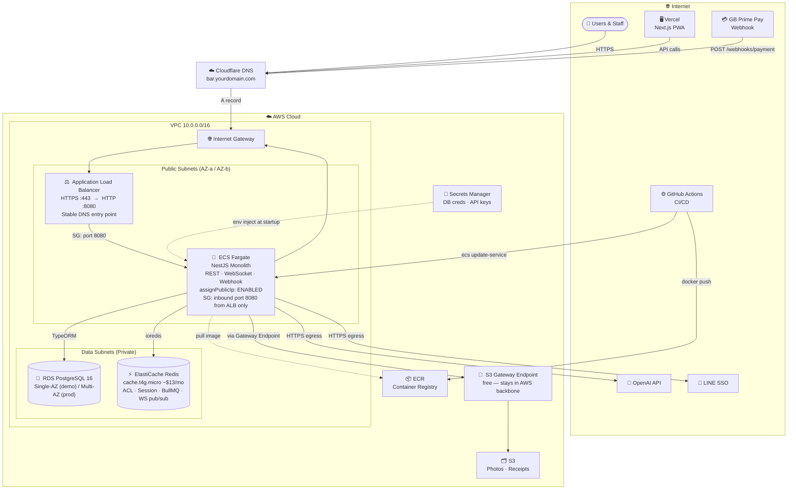

# Infrastructure Design — AI-Powered Bar Management System

**Last updated:** 2026-09-23
**Status:** Architecture locked. Implement last 2 weeks of November via Terraform (DR-001). Files: `infra/terraform/`.

---

## Architecture Decision: Public Subnet Fargate (No NAT)

### Final choice
Fargate tasks run in **public subnet** with `assignPublicIp: ENABLED`.

### Defense

**Why assign public IP to Fargate:**
1. **Cost** — NAT Gateway costs ~$32/month base + $0.045/GB transfer. Overkill for a senior project.
2. **No IP whitelisting required** — LINE SSO, OpenAI, and any external API used do not require a fixed outbound IP.
3. **Inbound controlled by Security Group** — only ALB security group can reach Fargate on port 8080. The public IP is never directly reachable.
4. **Outbound routes through IGW natively** — public subnet route table handles egress directly. No extra component needed.
5. **ECR image pull** — Fargate pulls images from ECR via IGW on task startup. Same region = no data transfer cost.

> "I assign a public IP to Fargate for outbound internet access — calling LINE SSO, OpenAI, and pulling ECR images. For inbound, all traffic enters through ALB and the security group locks Fargate to only accept connections from ALB on port 8080. The public IP is never directly exposed or reachable. NAT Gateway adds $32/month to solve a problem I don't have — neither LINE nor OpenAI require IP whitelisting, and my security boundary is already enforced at the SG level."

### When NAT would be justified
- Containers must run in private subnet (compliance / enterprise policy)
- External API requires fixed outbound IP (whitelisting)
- Need centralized egress logging

None of these apply to this project.

---

## Traffic Flows

### Inbound (API calls, webhook)
```
User / Vercel / GB Prime Pay
  → Cloudflare DNS
  → Internet Gateway
  → ALB (HTTPS :443 → HTTP :8080)
  → Fargate (NestJS) — SG: port 8080 from ALB only
```

### Outbound (external APIs)
```
Fargate → Internet Gateway → LINE SSO / OpenAI / ECR
```
Direct via route table. ALB is not in this path.

### Data
```
Fargate → RDS PostgreSQL    (TypeORM)
Fargate → ElastiCache Redis (ioredis) — ACL · Session · BullMQ · WS pub/sub
Fargate → S3                (via S3 Gateway Endpoint — free, stays in AWS backbone)
```

### CI/CD
```
GitHub Actions → docker push → ECR
GitHub Actions → ecs update-service → ECS
ECS → pull image from ECR (on task start)
```

---

## Infrastructure Diagram



---

## Component Breakdown

| Component | Service | Cost/mo | Notes |
|---|---|---|---|
| Frontend | Vercel | Free | Native Next.js, preview deploys per PR |
| Backend | ECS Fargate (0.25 vCPU / 0.5GB) | ~$9 | Scale to 2+ tasks when needed |
| Database | RDS PostgreSQL 16 db.t3.micro | ~$15 | Single-AZ for demo, multi-AZ for prod |
| Cache/Queue | ElastiCache cache.t4g.micro | ~$13 | ACL · Session · BullMQ · WS pub/sub |
| Load Balancer | ALB | ~$16 | Stable DNS entry point, SSL termination via ACM |
| Storage | S3 | ~$1 | Photos, receipts |
| DNS | Cloudflare | Free | Skip Route 53 |
| IaC | Terraform (`infra/terraform/`) | ~$0 | AWS + Cloudflare (+ Vercel) in one tool · state in S3 (native lock) |
| CI/CD | GitHub Actions | Free | Build → push ECR → deploy ECS |
| **Total** | | **~$54/mo** | |

### Demo / Presentation strategy
`terraform apply` → present (~2 hrs) → `terraform destroy`.
Cost per session: **~$0.11**. Use `skip_final_snapshot = true` on `aws_db_instance` to avoid lingering snapshot charges.

---

## Route Table Summary

**Public subnet route table:**
```
Destination     Target
10.0.0.0/16 →  local       (VPC internal)
0.0.0.0/0   →  IGW         (internet — inbound + outbound)
pl-xxxxxxxx →  S3 Endpoint  (S3 Gateway Endpoint — free)
```

**Data subnet route table:**
```
Destination     Target
10.0.0.0/16 →  local       (VPC internal only — no internet route)
```

---

## Terraform Rollout Plan
**Timeline:** Last 2 weeks of November. **Files:** `infra/terraform/`.

0. Bootstrap (once, outside the demo stack): S3 state bucket (versioned) — never destroyed by `terraform destroy`

Resources to provision (in order):
1. VPC + subnets + IGW + route tables
2. Security groups (ALB SG, Fargate SG, RDS SG, Redis SG)
3. S3 bucket + S3 Gateway Endpoint
4. RDS PostgreSQL
5. ElastiCache Redis
6. ECR repository
7. ECS cluster + task definition + service
8. ALB + target group + listener
9. Secrets Manager entries
10. GitHub Actions OIDC role (for CI/CD — no long-lived keys)
11. Cloudflare DNS records → ALB (`cloudflare` provider)
